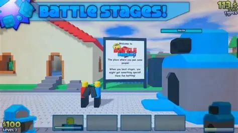

# 新遊戲設計專案

## 1. 遊戲概述
- **遊戲名稱**: wesley67 battle bricks
- **遊戲類型**: 塔防 (對攻式)
- **目標平台**: 網頁遊戲 (Web)
- **核心玩法**: 
    - **資源管理**: 系統會自動持續產生金幣，玩家需分配金幣召喚不同類型的小兵。
    - **對攻機制**: 小兵召喚後會自動向對方塔移動，與敵方小兵或防禦塔交戰。
    - **勝利條件**: 摧毀對方的防禦塔。
    - **角色養成**: 破關獎勵可用於在商店購買更強力的角色。

## 2. 遊戲故事與背景
- **背景設定**: wesley 失去了它的67能量 所以要擊敗對方的塔 擊敗一次拿到一個67能量 總共要集滿67個
- **主角介紹**: wesley(缺少了67能量 變很爛)
- **主要衝突**: 對方偷走了wesley的67能量

## 3. 核心機制 (Core Mechanics)
- **移動**: 自動移動 (小兵往對方塔前進)。
- **戰鬥/互動**: 自動戰鬥 (進入射程或碰撞時開始攻擊)。小兵與塔的血量管理是關鍵。
- **進度系統**: 
    - **67能量收集**: 遊戲共設有 67 個關卡，每通過一關獲得 1 個能量點，直到集滿 67 個。
    - **角色解鎖**: 隨著能量收集，玩家可以在商店解鎖更高階的「方塊人」戰士。
    - **塔升級**: 可使用金幣提升自家塔的血量或生產金幣的速度。

## 4. 藝術與音效風格
- **視覺風格**: 2D 復古/像素風格 (Pixel Art)，以「方塊人」為主要角色設計。

- **音樂/音效方向**: 
    - **音樂**: 8-bit / Chiptune 風格，節奏感強，營造戰鬥的緊迫感。
    - **音效**: 像素化的攻擊聲（如「嗶」、「啵」）、塔被摧毀時的電子爆炸聲。

## 5. 開發里程碑
- [ ] 概念設計
- [ ] 原型製作 (Prototype)
- [ ] Alpha 版本
- [ ] Beta 版本
- [ ] 正式發佈
